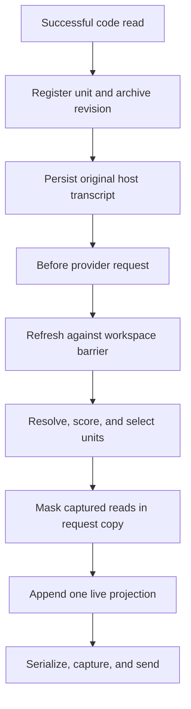

# Architecture

## Design statement

FreshCtx treats a coding-agent session as two related but different systems:

- an append-only event log containing intent, decisions, tool calls, errors, and
  evidence that something happened;
- a live materialized view containing the current bytes of mutable code units.

A file read is an event, but the read bytes are a snapshot of mutable state.
FreshCtx preserves the event and exact historical bytes outside the provider
payload, replaces the inline snapshot with a stable reference, and materializes
one current bounded view at request time.

## Request lifecycle



The stored host transcript is not destructively rewritten by the reference
adapters. The request copy is ephemeral. If the adapter fails before returning
a valid replacement, the host sends its original request.

## Layers

### 1. Observation adapter

Maps host-native successful reads to the FreshCtx observation contract:

```js
{
  observationId,
  path,
  scope: "file" | "region" | "symbol",
  selector,
  startLine,
  endLine,
  content,
  turn
}
```

It records the native tool-call ID so the corresponding result can be masked in
the request copy. Failed, binary, oversized, or out-of-root reads are not
captured and remain ordinary host observations.

### 2. Revision archive

Every observed or resolved byte sequence receives a SHA-256 revision. The
prototype keeps revisions in memory. Production uses a repository-scoped local
store with:

- content-addressed blobs;
- observation-to-revision edges;
- unit lifecycle records;
- bounded retention and explicit garbage collection;
- encryption/permissions consistent with the workspace;
- no cloud dependency.

Archive bytes never enter a request unless the live resolver selects their
current revision or the user explicitly asks to recover historical evidence.

### 3. Unit registry

The prototype unit contains:

| Field | Meaning |
|---|---|
| `id` | Stable identity independent of content revision |
| `path` | Normalized repository-relative source path |
| `scope` | Whole-file, line-region, or symbol scope |
| `selector` | Structural selector when present |
| `content` | Last safely resolved current bytes |
| `revision` | `sha256:<digest>` of current bytes |
| `anchors` | Conservative boundary evidence |
| `state` | `resolved` or `unresolved` |
| `resolutionMethod` | Exact, boundary, whole-file, structural, or failure reason |
| `versions` | Exact recoverable observations |
| lifecycle fields | Observation, use, change, and pin metadata |

Stable identity and content identity are separate. Markers contain stable unit
identity but not the volatile revision hash.

### 4. Resolver

Whole-file and line-region refresh use exact content and conservative boundary
anchors. Symbol refresh calls the out-of-process Isolated Semantic Engine, whose
Tree-sitter implementation supports Python, JavaScript, TypeScript, Go, and
Rust. Parser packages are never imported by `src/`, which remains Node.js
standard-library-only.

When a runner is injected, whole-file and line-region units on `.py`, `.js`,
`.mjs`, `.cjs`, `.ts`, and `.tsx` also refresh through the Isolated Semantic
Engine (PCR 0114). Go and Rust file/region units use exact and anchor
relocation only; the engine parses both languages, but the file/region route
has not been measured on the go-tools apex pack, so the gate stays as PCR 0114
left it (`FILE_REGION_ISE_EXTENSIONS` in `src/registry.mjs`). Symbol
units consult the engine in every supported language.

Resolution fails closed:

1. accept a unique exact or structural match;
2. otherwise accept a unique best pair of normalized boundary anchors where
   that scope permits it;
3. otherwise mark the unit unresolved.

The production resolution hierarchy is:

1. stable LSP/SCIP identity where the provider guarantees it;
2. qualified Tree-sitter structural path;
3. content hash plus robust boundary anchors;
4. unchanged file revision plus exact recorded range;
5. explicit unresolved/tombstone.

Resolution is fail-closed with respect to freshness: last-known bytes are never
rendered as current. It is fail-open at the host boundary: if the entire
FreshCtx transformation cannot complete, the adapter returns no replacement and
the host retains normal behavior.

### 5. Working-set policy

Selection is an online cache decision. The prototype scores resolved units by
pinning, recency, task-term overlap, current-turn change, and size. Production
may add edit involvement, dependency distance, diagnostics, stack traces, and
language-provider confidence.

Selection order and render order are intentionally separate:

- selection maximizes required-set coverage under a byte budget;
  same-turn `refresh()` of an already-tracked unit is always selected even when
  its body exceeds the cap; a first-time read still competes for the cap
  (PCR 0080);
- rendering places stable, low-change units before volatile units to improve
  prefix reuse.

Autoresearch may change only the declared policy search surface. CtxBench
protects trace data, gold labels, metrics, thresholds, and held-out splits.

### 6. Projector

The projector emits a single self-describing live block. Each unit includes
stable ID, path, range, current revision, resolution method, and the UTF-8
length of its rendered body. Units appear at most once. Unresolved and
budget-omitted counts are explicit.

Rendering is stateless. `renderUnit` is a function of one unit, and
`projectContext` is a function of the registry, the turn, the task, and the
budget. Neither one knows what an earlier request contained, so a selected unit
always carries its current bytes. If the projector knew, it could be tempted to
send a revision digest instead, and a digest is a reference to the bytes rather
than the bytes. [PCR 0079](lab/pcr/0079-stateless-byte-exact-requests.md) records
where that temptation led and why the state was removed.

A unit is either selected with its full current bytes or reported as unresolved
or budget-omitted. There is no third rendering.

The XML-like prototype format is not a security boundary. Production should use
a host-native data/content distinction when the provider supports one, escape
metadata, preserve code bytes exactly, and treat source comments as untrusted
data rather than instructions.

### 7. Host adapter

An adapter owns protocol-specific work:

- capture native read events;
- preserve assistant/tool/result pairing;
- map tool IDs to FreshCtx unit IDs;
- enforce the workspace root and file limits;
- call refresh before every provider payload;
- mask only observations it can refresh;
- marker-replace request-copy dumps of a single already-tracked path
  (PCR 0081) and recognized multi-path dumps whenever at least one named path is
  already tracked; unmatched named paths are called out as not supplied, and
  path matching stays fail-closed exact (PCR 0084, PCR 0091);
- append or inject the projection in a schema-valid location;
- return the original request on adapter failure;
- expose telemetry and version information.

The minimal executable boundary is `adapters/host-codec.mjs`. It snapshots the
original host request, gives every codec callback only a clone, validates the
transformed host-native schema, and returns the original object on any failure.
Pairing rules belong to each codec's validator because hosts encode assistant
calls and tool results differently. The no-model test double in
`adapters/host-codec-test-double.mjs` covers capture, transformation, pair
corruption, and byte-identical fail-open behavior. Every codec declares its
host and adapter versions plus whether the host can rewrite request context.

The core never imports Pi, Hermes, OMP, OpenAI, Anthropic, or Google message
types.

## Pi integration

Pi exposes a `tool_result` event after tools execute and a `context` event before
each LLM call. The reference adapter records successful `read` calls, leaves the
stored result untouched, then rewrites matching tool results in the request copy
and appends the live projection through `context`.

The adapter synchronizes whole text files, line regions, and explicit symbol
reads. Path-only reads and pagination that reaches end of file resolve to file
scope. Explicit `scope: "region"` reads and finite `offset` and `limit` pairs map
to line ranges; `scope: "symbol"` reads refresh through the Isolated Semantic
Engine when the file language is supported. The adapter also recognizes
cat-class shell reads and routes them through the same workspace guard as the
official `read` tool.

Persisted call mappings across restart, pinned-package type checking, and native
provider-capture tests remain product gates.

## Hermes integration

Hermes' `ContextEngine.select_context()` can replace the messages for one
request without changing the persisted transcript, and `on_turn_complete()` can
observe a completed turn. The preview plugin subclasses Hermes'
`ContextCompressor`, preserving normal compaction, and invokes the Node core
through a fail-open local bridge.

The bridge recognizes common OpenAI-format read tools and cat-class shell
commands, and projects whole files and line regions under the same end-of-file
rules as Pi. It persists only tool-call and path mappings, and it writes that
state from `on_turn_complete()` alone. `select_context()` reads state and never
writes it, which keeps one request from changing what the next request contains.
Production should package the core as a stable Isolated Semantic Engine or native library and add
per-session locking, schema fixtures, and lifecycle cleanup.

## Why MCP is not the primary integration

An MCP server can expose explicit `track`, `refresh`, `recover`, and `status`
tools. It cannot force an arbitrary host to remove an earlier tool result from
the provider request. FreshCtx therefore needs a per-request host middleware
surface for its defining invariant. MCP is useful as a compatibility and
inspection plane, not sufficient as the data plane.

## Cache layout

FreshCtx optimizes three different quantities:

1. fewer bytes in the current request;
2. fewer changed bytes between consecutive requests;
3. a longer stable prefix before the first changed byte.

These goals can conflict. Revision metadata near the front of a request may
invalidate a large prefix even if total bytes fall. The projector therefore
keeps historical markers stable, renders unchanged units first, puts volatile
units late, and reports prefix reuse plus delta amplification. Provider cache
tokens are an optional external measurement, not inferred from token count.

All three quantities are measured over requests that already satisfy the
stateless rule. Dropping the body of a selected unit lowers every one of them
and is still wrong, so byte and prefix work happens through selection, ordering,
and unit grain. It never happens by omitting bytes the projection claims to
carry.

## Workspace consistency

The prototype reads files sequentially through a caller-supplied provider.
Production needs a request snapshot barrier:

- capture a filesystem generation or watcher sequence number;
- read all selected sources against that generation when possible;
- detect a write that occurs during refresh;
- retry a bounded number of times or mark affected units unresolved;
- record the observed generation in telemetry.

FreshCtx must not combine half of one revision with half of another and call it
current.

## Failure matrix

| Failure | Freshness behavior | Host behavior |
|---|---|---|
| Unit ambiguous | Omit and report unresolved | Continue with transformed request |
| File deleted | Tombstone/omit, never use old bytes | Continue |
| Path escapes root | Do not capture or refresh | Preserve native observation |
| Binary/oversized file | Do not capture | Preserve native observation |
| Adapter throws | No replacement returned | Send original host request |
| Archive unavailable | Do not promise recovery; surface unhealthy status | Configurable fail-open before masking |
| Workspace changes mid-refresh | Retry or unresolved | Continue only with coherent units |
| Projection exceeds budget | Deterministic omissions | Continue with omission metadata |

## Sharp-edge audit

`KEEP` marks intentional behavior protected by invariants. `DOCUMENT` marks
valid but surprising behavior that callers must account for. `FIX` requires a
bounded defect and a red-green invariant test.

| Sharp edge | Classification | Contract or action |
|---|---|---|
| PCR 0079 stateless request bodies | KEEP | Every selected unit carries its current bytes in every request, including unchanged later turns. |
| PCR 0080 refreshed-unit cap exception | KEEP | A same-turn refresh of an already observed unit may exceed the cap; first-time reads still compete for it. |
| Fail-closed freshness | KEEP | Ambiguous, missing, or unsafe current bytes are omitted; last-known bytes are never injected. |
| Adapter fail-open | KEEP | A failed host transformation returns the original native request unchanged. |
| Selection order versus render order | KEEP | Selection maximizes utility under budget; rendering independently stabilizes the request prefix. |
| Revision-free historical markers | KEEP | Marker identity stays stable across content revisions; current revision metadata belongs in the live projection. |
| Process-local adapter state | DOCUMENT | Pi and the current archive lose FreshCtx mappings on restart; host-persisted history remains untouched. |
| Out-of-process parser availability | DOCUMENT | A missing or failed Isolated Semantic Engine makes structural units unresolved rather than falling back to stale bytes. |
| Local apex classification | DOCUMENT | `holdout-v0.3-apex` is locally frozen; production GitHub Actions attestation is still absent. |
| Programmatic benchmark report writes | FIX | `runNestedHelperShowdown()` rewrote tracked timing/RSS reports during `npm test`. Programmatic calls now default to no writes; CLI entrypoints opt in. `test/report-hygiene.test.mjs` is the red-green invariant. |
| Budget-omit inlining ignores unit state | FIX | The PCR 0108 quoteability pass inlined `unit.content` for a previously budget-omitted read without checking that the unit was currently `resolved`. `shouldInlineBudgetOmittedReadAtToolResult` now returns false unless `unit.state === "resolved"`; `test/pcr-0161-unresolved-no-inline.test.mjs` is the red-green invariant (PCR 0161). |
| Hermes bridge with zero tracked units | FIX | When every shell read failed workspace validation (wrong `cwd`), the bridge pruned all read pairs and returned them with `applied: false`, and the Python plugin applied them anyway. The bridge now returns the original messages when nothing was tracked and `select_context` honours `applied`; `test/hermes-bridge.test.mjs` and `test/python/test_hermes_engine.py` pin both sides (PCR 0162). |
| Isolated Semantic Engine client bounds | FIX | The spawn client had no stdin error handler, timeout, or output cap; a child that exited early raised an uncaught `EPIPE` in the host. The client now rejects on stdin errors, kills and rejects after `timeoutMs` (10 s) and above `maxOutputBytes` (16 MiB); `test/treesitter-ise-client.test.mjs` is the invariant (PCR 0163). |
| Shell `head`/`tail` span arithmetic | FIX | Pi and Hermes derived the region span from the flag count with different formulas, Pi did not verify it against the observed bytes, and `-nN` did not parse. Both now call `observedSpanForShellRead`, which requires exactly `min(requested, body)` observed lines matching the file slice and fails closed otherwise; `test/shell-read-head-tail.test.mjs` is the invariant (PCR 0164). |
| Hermes reads observed from persisted arguments only | FIX | A Hermes `pre_tool_call` `modify` directive changes what a read executes with but not the persisted `tool_calls`, so the bridge tracked a path the host never read (`source-error`, unit omitted, `resolution=none` in the dump scan). The plugin now records executed read arguments from `post_tool_call` and the bridge prefers them, persisting `executedReadArgsByCallId` in session state; `test/pcr-0165-hermes-executed-read-args.test.mjs` and `test/python/test_hermes_engine.py` pin both sides (PCR 0165). |
| Hermes executed-read store per module | FIX | Hermes imports the plugin once through `plugins/context_engine/` (its collector's `register_hook` is a no-op) to select the engine and again through the general plugin loader, whose copy's `post_tool_call` fires. The PCR 0165 module-level store left the serving engine's dict empty, so the bridge fell back to the persisted path and the envelope carried no unit. The store is now one `sys.modules` entry per process; `test/pcr-0166-hermes-executed-reads-one-store.test.mjs` and `OneStorePerProcess` in `test/python/test_hermes_engine.py` are the red-green invariant (PCR 0166). |

| Multi-turn rows read the proxy's 404 records | FIX | Hermes' `openai-api` overlay GETs `/api/v1/models` many times a turn, the trial proxy persists an `unmatched-NNN.json` metadata record per 404, and the turn's dump list globbed every non-scan `*.json`, so `cellRow` read `requests.at(-1)` off a record with no body and every `freshctx-ts` row printed `resolution=none` while the adapter had resolved. `isProviderDumpName` in `docs/lab/hermes-trial-ts/proxy.mjs` now owns the dump-name rule for both readers; `test/pcr-0167-provider-dump-names.test.mjs` and `test/pcr-0167-hermes-engine-registered.test.mjs` are the red-green invariant (PCR 0167). |
| Hermes bridge fall-open left no trace | FIX | `_call_bridge` returned None on a non-zero exit, a timeout, an OSError, a non-JSON stdout, or a missing state file, so Hermes sent its own request and the provider dumps, the engine-registered gate, and the row (`resolution=none`, exit 0) could not tell a fallen-open bridge from an unresolved unit. The adapter now logs each path through logger `freshctx.hermes` into `HERMES_HOME/logs/agent.log`, and `assertFreshCtxProjectionSeen` fails a freshctx arm's t1 row closed when no provider dump carries the FreshCtx envelope, quoting those lines; `test/pcr-0168-hermes-projection-seen.test.mjs` and `test/python/test_hermes_bridge_fell_open.py` are the red-green invariant (PCR 0168). |

## Security boundary

- Canonicalize paths and verify real paths remain under the active root.
- Reject escaping symlinks by default.
- Never read credentials or files merely because a code comment names them.
- Store historical revisions locally with least privilege and retention limits.
- Do not log source bodies in telemetry by default; use revisions and byte
  counts.
- Treat source as untrusted prompt data.
- Preserve host redaction, permissions, and approval behavior.
- Run CtxBench with network disabled and a disposable writable worktree.

## Current evidence and product gaps

| Area | Current repository fact | Missing production evidence or mechanism |
|---|---|---|
| Core | In-memory and Node.js standard-library-only | Persistent local service/library |
| Unit type | Whole-file, line-region, and symbol scope | Broader structural validation corpus |
| Structural languages | Out-of-process Tree-sitter for Python, JavaScript, TypeScript, Go, and Rust | Versioned parser compatibility matrix |
| Snapshot | Sequential source provider | Coherent workspace generation |
| Recovery | In-memory revision map | Durable encrypted/permissioned archive |
| Pi | Request-only adapter with deterministic replay tests | Pinned host package and session persistence |
| Hermes | Request-only plugin, bridge, installer, and replay tests | Published package, locks, and compatibility matrix |
| Tests | Core and adapter invariants run without a model | Released-host end-to-end matrix |
| Evaluate | `holdout-v0.3-apex` defaults on this checkout; recorded ISE 8589 payload bytes, whole-file 36701 payload bytes, required recall 5/5 (measured 2026-09-02; 8504 before the Isolated Semantic Engine vocabulary migration lengthened the `resolution` label) | Pack is locally frozen, not production-GHA sealed; timing and RSS remain local telemetry |

`passAt1` is always `null` and out of scope for this deterministic context
benchmark. There are 164 Public Change Records under `docs/lab/pcr/`.
