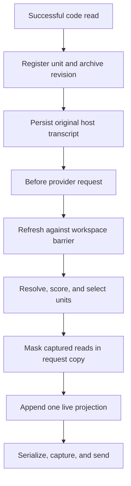

# Architecture

## Design statement

FreshCtx treats a coding-agent session as two related but different systems:

- an append-only event log containing intent, decisions, tool calls, errors, and
  evidence that something happened;
- a live materialized view containing the current bytes of mutable code units.

A file read is an event, but the read bytes are a snapshot of mutable state.
FreshCtx preserves the event and exact historical bytes outside the provider
payload, replaces the inline snapshot with a stable reference, and materializes
one current bounded view at request time.

## Request lifecycle



The stored host transcript is not destructively rewritten by the reference
adapters. The request copy is ephemeral. If the adapter fails before returning
a valid replacement, the host sends its original request.

## Layers

### 1. Observation adapter

Maps host-native successful reads to the FreshCtx observation contract:

```js
{
  path,
  scope: "file" | "region" | "symbol",
  selector,
  startLine,
  endLine,
  content,
  turn
}
```

Core `trackRead` stores a stable `unit.id` from `stableUnitId`. It does not
store a separate observation id. Adapters keep the host tool-call id in an
in-process `callToUnit` map so the matching result can be masked. Transcript
markers write that unit id as `metadata.freshctx.unitId`.

The two scopes take their bytes from different sources. A file-scope read
tracks the bytes the adapter reads from disk under the workspace guard, not the
body the host printed in its tool result. A region-scope or symbol-scope read
tracks the tool-result body, because the host result is the only record of which
slice the model actually saw. A region read records the file's line count at
observation time so refresh can fall back to the stored line span. A region read
whose tool result is empty is skipped rather than tracked.

Failed, binary, oversized, or out-of-root reads are not captured and remain
ordinary host observations.

### 2. Revision archive

Every observed or resolved byte sequence receives a SHA-256 revision. The
prototype keeps revisions in memory. Production uses a repository-scoped local
store with:

- content-addressed blobs;
- observation-to-revision edges;
- unit lifecycle records;
- bounded retention and explicit garbage collection;
- encryption/permissions consistent with the workspace;
- no cloud dependency.

Archive bytes never enter a request unless the live resolver selects their
current revision or the user explicitly asks to recover historical evidence.

### 3. Unit registry

The prototype unit contains:

| Field | Meaning |
|---|---|
| `id` | Stable identity independent of content revision |
| `path` | Normalized repository-relative source path |
| `scope` | File, region, or symbol. Symbol units resolve through the out-of-process Tree-sitter sidecar |
| `selector` | Structural selector when present |
| `content` | Last safely resolved current bytes |
| `revision` | `sha256:<digest>` of current bytes |
| `anchors` | Conservative boundary evidence |
| `state` | `resolved` or `unresolved` |
| `resolutionMethod` | Exact, boundary, whole-file, structural, or failure reason |
| `versions` | Exact recoverable observations |
| lifecycle fields | Observation, use, change, and pin metadata |

Stable identity and content identity are separate. Markers contain stable unit
identity but not the volatile revision hash.

### 4. Resolver

The current prototype tries, in order:

1. the out-of-process Tree-sitter sidecar, for symbol units always, and for
   file and region units when a sidecar runner is present and the extension is
   `.py`, `.js`, `.mjs`, `.cjs`, `.ts`, or `.tsx`;
2. unique exact occurrence of the previous region;
3. a unique best pair of normalized boundary anchors;
4. the stored line span, for a single-line region only, and only when the file's
   line count still matches the count recorded at observation time;
5. unresolved.

A `parse-broken` result from the sidecar blocks step 4 instead of falling
through to it. A broken parse is evidence the line numbers moved. Go and Rust
file and region units skip step 1 even when the sidecar can parse those
extensions. That split is documented in ADR 0004. Extending the registry gate
is a separate change because adapter and core sidecar injection differ.

The production resolution hierarchy is:

1. stable LSP/SCIP identity where the provider guarantees it;
2. qualified Tree-sitter structural path;
3. content hash plus robust boundary anchors;
4. unchanged file revision plus exact recorded range;
5. explicit unresolved/tombstone.

Resolution is fail-closed with respect to freshness: last-known bytes are never
rendered as current. It is fail-open at the host boundary: if the entire
FreshCtx transformation cannot complete, the adapter returns no replacement and
the host retains normal behavior.

### 5. Working-set policy

Selection is an online cache decision. The prototype scores resolved units by
pinning, recency, task-term overlap, current-turn change, and size. Production
may add edit involvement, dependency distance, diagnostics, stack traces, and
language-provider confidence.

Selection order and render order are intentionally separate:

- selection maximizes required-set coverage under a byte budget;
  same-turn `refresh()` of an already-tracked unit is always selected even when
  its body exceeds the cap; a first-time read still competes for the cap
  (PCR 0080);
- rendering places stable, low-change units before volatile units to improve
  prefix reuse.

Autoresearch may change only the declared policy search surface. CtxBench
protects trace data, gold labels, metrics, thresholds, and held-out splits.

### 6. Projector

The projector emits a single self-describing live block. Each unit includes
stable ID, path, range, current revision, resolution method, and the UTF-8
length of its rendered body. Units appear at most once. Unresolved and
budget-omitted counts are explicit.

Rendering is stateless. `renderUnit` is a function of one unit, and
`projectContext` is a function of the registry, the turn, the task, and the
budget. Neither one knows what an earlier request contained, so a selected unit
always carries its current bytes. If the projector knew, it could be tempted to
send a revision digest instead, and a digest is a reference to the bytes rather
than the bytes. [PCR 0079](lab/pcr/0079-stateless-byte-exact-requests.md) records
where that temptation led and why the state was removed.

A unit is either selected with its full current bytes or reported as unresolved
or budget-omitted. There is no third rendering.

An empty selection still emits the envelope. `projectContext` writes the opening
tag with `selected="0"` and the unresolved and budget-omitted counts, writes the
closing tag, and drops only the preamble sentence. A reader can tell the
difference between FreshCtx selecting nothing and FreshCtx not running.

The decoder frames each unit by byte length instead of searching for the closing
tag. `renderUnit` writes `content-bytes` as the UTF-8 length of the body, and
`decodeProjectionUnits` reads exactly that many bytes, then checks that the
closing frame lands where the length said it would. Source code may legally
contain the string `</freshctx-unit>`, and a delimiter search would truncate that
unit. A length that does not align with its closing frame throws rather than
returning a short unit.

The XML-like prototype format is not a security boundary. Production should use
a host-native data/content distinction when the provider supports one, escape
metadata, preserve code bytes exactly, and treat source comments as untrusted
data rather than instructions.

### 7. Host adapter

An adapter owns protocol-specific work:

- capture native read events;
- preserve assistant/tool/result pairing;
- map tool IDs to FreshCtx unit IDs;
- enforce the workspace root and file limits;
- call refresh before every provider payload;
- mask only observations it can refresh;
- marker-replace request-copy dumps of a single already-tracked path
  (PCR 0081) and recognized multi-path dumps whenever at least one named path is
  already tracked; unmatched named paths are called out as not supplied, and
  path matching stays fail-closed exact (PCR 0084, PCR 0091);
- append or inject the projection in a schema-valid location;
- return the original request on adapter failure;
- expose telemetry and version information.

The core never imports Pi, Hermes, OMP, OpenAI, Anthropic, or Google message
types.

## Pi integration

Pi exposes a `tool_result` event after tools execute and a `context` event before
each LLM call. The reference adapter records successful `read` calls, leaves the
stored result untouched, then rewrites matching tool results in the request copy
and appends the live projection through `context`.

The adapter synchronizes whole text files and line regions. Path-only reads and
pagination that reaches end of file resolve to file scope. Explicit
`scope: "region"` reads and finite `offset` and `limit` pairs map to line ranges,
and interior edits can refresh through a stored line span without a re-read. The
adapter also recognizes cat-class shell reads and routes them through the same
workspace guard as the official `read` tool.

Symbol scope ships and refreshes through the sidecar. Persisted call mappings
across restart, pinned-package type checking, and native provider-capture tests
are release gates.

## Hermes integration

Hermes' `ContextEngine.select_context()` can replace the messages for one
request without changing the persisted transcript, and `on_turn_complete()` can
observe a completed turn. The preview plugin subclasses Hermes'
`ContextCompressor`, preserving normal compaction, and invokes the Node core
through a fail-open local bridge.

The bridge recognizes common OpenAI-format read tools and cat-class shell
commands, and projects whole files, line regions, and symbol units under the
same end-of-file rules as Pi. `on_turn_complete()` writes tool-call and path
mappings. `select_context()` also writes pending-ack fields
(`pendingInjectedRevision`, `pendingAckAfterUserIndex`) before it returns, so
the next turn can acknowledge an inject that this request just produced
(PCR 0097). Official file-scope reads track `observation.content` from the
persisted tool message. Pi official file reads track disk bytes instead. The
live Hermes bridge does not read `FRESHCTX_SIDECAR`.
Production should package the core as a stable sidecar or native library and add
per-session locking, schema fixtures, and lifecycle cleanup.

## Why MCP is not the primary integration

An MCP server can expose explicit `track`, `refresh`, `recover`, and `status`
tools. It cannot force an arbitrary host to remove an earlier tool result from
the provider request. FreshCtx therefore needs a per-request host middleware
surface for its defining invariant. MCP is useful as a compatibility and
inspection plane, not sufficient as the data plane.

## Cache layout

FreshCtx optimizes three different quantities:

1. fewer bytes in the current request;
2. fewer changed bytes between consecutive requests;
3. a longer stable prefix before the first changed byte.

These goals can conflict. Revision metadata near the front of a request may
invalidate a large prefix even if total bytes fall. The projector therefore
keeps historical markers stable, renders unchanged units first, puts volatile
units late, and reports prefix reuse plus delta amplification. Provider cache
tokens are an optional external measurement, not inferred from token count.

All three quantities are measured over requests that already satisfy the
stateless rule. Dropping the body of a selected unit lowers every one of them
and is still wrong, so byte and prefix work happens through selection, ordering,
and unit grain. It never happens by omitting bytes the projection claims to
carry.

## Workspace consistency

The prototype reads files sequentially through a caller-supplied provider.
Production needs a request snapshot barrier:

- capture a filesystem generation or watcher sequence number;
- read all selected sources against that generation when possible;
- detect a write that occurs during refresh;
- retry a bounded number of times or mark affected units unresolved;
- record the observed generation in telemetry.

FreshCtx must not combine half of one revision with half of another and call it
current.

## Behavior that stays fixed

Each behavior below has a test. Changing one is its own reviewable change with
a stated reason, not a side effect of an optimization.

- `renderUnit` embeds `unit.content` on every call. It has no branch that puts
  a revision digest, a summary, or a marker where a selected unit's body goes.
- A read marker carries the stable unit id and the path. It never carries the
  revision hash, so the marker text is unchanged by a content revision.
- A unit whose state is not `resolved` scores negative infinity and is omitted
  with reason `unresolved`. Last-known bytes are never rendered as current. The
  archived revision stays reachable through `registry.recover()`, which no
  projection path calls.
- An already-tracked unit whose bytes changed this turn is selected before the
  budget loop runs, so its body ships even when it is larger than the cap. A
  first-time read competes for the cap like anything else.
- Selection order and render order are computed separately. Selection ranks by
  pinned, then score, then id. Rendering re-sorts by change count, then id. Do
  not collapse the two into one sort.
- A projection with zero selected units still emits the envelope and its counts.
- The decoder reads each unit body by the `content-bytes` length. It does not
  search for a closing tag.
- When the sidecar reports `parse-broken`, refresh skips the stored-line-span
  rescue.
- If the adapter throws, the host sends its original request. Pi returns
  `undefined`. Hermes returns `None`.

## Failure matrix

| Failure | Freshness behavior | Host behavior |
|---|---|---|
| Unit ambiguous | Omit and report unresolved | Continue with transformed request |
| File deleted | Tombstone/omit, never use old bytes | Continue |
| Path escapes root | Do not capture or refresh | Preserve native observation |
| Binary/oversized file | Do not capture | Preserve native observation |
| Adapter throws | No replacement returned | Send original host request |
| Archive unavailable | Do not promise recovery; surface unhealthy status | Configurable fail-open before masking |
| Workspace changes mid-refresh | Retry or unresolved | Continue only with coherent units |
| Projection exceeds budget | Deterministic omissions | Continue with omission metadata |

## Security boundary

- Canonicalize paths and verify real paths remain under the active root.
- Reject escaping symlinks by default.
- Never read credentials or files merely because a code comment names them.
- Store historical revisions locally with least privilege and retention limits.
- Do not log source bodies in telemetry by default; use revisions and byte
  counts.
- Treat source as untrusted prompt data.
- Preserve host redaction, permissions, and approval behavior.
- Run CtxBench with network disabled and a disposable writable worktree.

## Prototype versus product

| Capability | 0.1 prototype | Product gate |
|---|---|---|
| Core | In-memory, Node standard library | Persistent local service/library |
| Unit type | Whole file, anchored region, and sidecar-resolved symbol | Structural symbols across every declared language family |
| Snapshot | Sequential source provider | Coherent workspace generation |
| Recovery | In-memory revision map | Durable encrypted/permissioned archive |
| Policy | Lexical deterministic heuristic | CtxBench-optimized frozen policy |
| Pi | Reference TypeScript adapter | Pinned package, session persistence, CI |
| Hermes | Preview bridge plugin | Packaged engine, locks, compatibility matrix |
| Benchmark | Synthetic executable | Public-repo trace pack and capture provider |
| Claim | Byte-level correctness on unsealed traces plus one sealed pack | The full gate list in `docs/EVALUATION.md` §13 |
