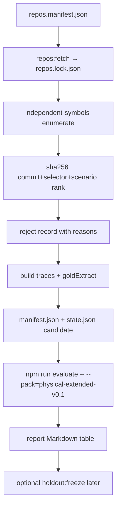

# CORVUS metric mapping and verifiable physical-pack pipeline

Status: design contract for the next candidate pack family. Not a result.
Keywords **MUST**, **MUST NOT**, **SHOULD**, and **MAY** are normative.

This document is the only place that translates [CORVUS](https://arxiv.org/abs/2607.22711)
(Zheng et al., 2026; arXiv:2607.22711v1; PDF sha256
`204af5d8df1a25d09dcc2ef154b2aac8d3d3fcea4c9c737a511129f40cd27eaf`) into CtxBench
telemetry. It does **not** authorize a “we beat CORVUS” sentence. ADR 0003 is
still the deviation table for the `corvus-file` reproduction. ADR 0002 still
forbids Pass@1 as a core metric.

`holdout-v0.3-apex` is read-only. This pipeline **MUST** emit a new candidate
pack or a derived report. It **MUST NOT** rewrite apex traces, `results.jsonl`,
freeze hashes, or the Isolated Semantic Engine.

## 1. What the paper measures vs what CtxBench measures

CORVUS reports an *agent loop* on SWE-PolyBench Verified and SWE-Bench Pro:
input tokens, final request length, reasoning-cycle count, duplicate file
reads, and Pass@1 across four LLMs ([THESIS.md](../THESIS.md) §3; cited, not
reproduced here).

CtxBench reports a *deterministic transformer*
\(T(W_t, H_t, Q_t, B, \theta) \rightarrow (P_t, A_t)\)
([EVALUATION.md](EVALUATION.md) §1). Default `npm run evaluate` compares
Isolated Semantic Engine (`isolated-semantic-engine`) to the documented
whole-file reproduction (`corvus-file`) on a physical pack. There is no model
call.

The two vocabularies can be read side by side. They are not the same
experiment. A mapping alias **MUST NOT** be treated as a SWE-bench
reproduction.

### 1.1 Translation table

| CORVUS paper metric | CtxBench field | What it actually is | What it is not |
|---|---|---|---|
| Duplicate file reads | `corvusEquivalents.redundantReadEvents` plus payload uniqueness | Trace-side: repeated `read` events on the same `path`/`scope`/`selector`. Payload-side: enclosing-span targeting so \(C_t\) is one current unit, not the whole registered file, and `duplicateCodeCopies` stays 0 | Agent `read_file` count on SWE. `sync_context` re-reading \(S_t\) every cycle is the paper’s *correct* refresh, not a duplicate-read event |
| Reasoning cycles | `corvusEquivalents.reasoningCycles` | Count of `capture-request` events on the fixed trace | `llm_invoke` count. Both systems see the same trace, so `cycleReductionVsCorvus` **MUST** be `0` |
| Pass@1 | `corvusEquivalents.passAt1` | Always `null`; `passAt1Reason` is `out-of-scope-adr-0002` | Oracle retention. Recall 1.0 is a freshness gate, not a patch success rate |
| Final request length | `comparison.payloadBytes` / `corvusEquivalents.finalRequestBytes` | UTF-8 bytes of the last capture on each trace, summed. Isolated Semantic Engine vs `corvus-file` | Tokenizer tokens. Host system/tool schema bytes (ADR 0003) |
| Accumulated token usage | `corvusEquivalents.accumulatedPayloadBytes` | Sum of every capture `payloadBytes` on the trace | Model tokens. A versioned tokenizer study is a separate dataset |
| Execution time | `resources.latencyMs` (alias `executionTimeMs`) | Isolated Semantic Engine transform `totalMs` p50 / p95 / max | Agent wall time. Laptop RSS/latency is telemetry, not a publishable latency claim ([EVALUATION.md](EVALUATION.md) §10) |

`oracleRetention.recall` is required-current recall ([EVALUATION.md](EVALUATION.md)
§8.2). It **MUST** stay the hard gate. It **MUST NOT** be printed as Pass@1 or
as “preserved pass rate.”

## 2. How FreshCtx challenges the CORVUS architecture

CORVUS Algorithm 1 keeps a file set \(S_t\) and, on every reasoning cycle,
rebuilds \(C_t = \{(f_j, c_j(t)) : f_j \in S_{t-1}\}\) (ADR 0003). That is
whole-file uniqueness and freshness. The paper’s own discussion lists whole-file
granularity as an open problem.

FreshCtx keeps a *unit* set. The Isolated Semantic Engine resolves a selector
against the current workspace and projects the enclosing span that the
independent gold enumerator named. The challenge is therefore:

1. **Same traces, smaller \(C_t\).** Negative `payloadBytes` delta vs
   `corvus-file` is the primary efficiency claim. Measured on
   `holdout-v0.3-apex` (PCR 0129 / evaluate 2026-08-31, laptop): candidate
   **8504**, baseline **36701**, delta **−28197**, recall **5/5**. Those
   numbers are sealed-board telemetry. This pipeline **MUST NOT** change them.
2. **Nested enclosing-span targeting.** A nested helper (Flask
   `class View::method as_view::if@0::function view`) is one unit. CORVUS still
   injects `src/flask/views.py`. That is the duplicate-*content* mitigation:
   one current copy of the requested span, not the sibling class and not a
   second historical snapshot.
3. **Fail-close instead of sibling bleed.** An `ERROR` or `MISSING` node on
   the resolution path returns no match. Syntax bleeding would inflate recall
   with the wrong bytes and silently copy neighbors. Fail-close keeps
   `oracleRetention` honest.
4. **Reasoning-cycle count is conserved.** CtxBench does not delete
   `capture-request` events. Cycle reduction vs CORVUS on a fixed trace is
   defined to be zero. Any later agent study that observes fewer `llm_invoke`
   calls is a *different* dataset and cannot rewrite this board.

### 2.1 Duplicate reads: two numbers, one claim

Do not collapse these:

- **Trace duplicates** (`redundantReadEvents`). Fixed by the authored timeline.
  Enclosing-span does not remove a `read` event.
- **Payload duplicates** (`duplicateCodeCopies`, EVALUATION §8.4). Extra gold
  copies in \(P_t\). The Isolated Semantic Engine **MUST** keep this at 0
  (uniqueness).
- **CORVUS refresh reads.** `sync_context` re-reads every file in \(S_t\)
  every cycle. That is the paper. FreshCtx’s analogue is one resolve of each
  selected unit. The byte saving is in \(C_t\), not in a smaller SWE
  `read_file` counter.

The sentence this board is allowed to use:

> On the same physical traces, enclosing-span Isolated Semantic Engine
> projection is byte-smaller than whole-file `corvus-file` while required
> gold is retained exactly.

The sentence this board is **not** allowed to use:

> FreshCtx reduces duplicate file reads / reasoning cycles / Pass@1 versus
> CORVUS on SWE-PolyBench.

### 2.2 Pass@1 and “100% recall”

Recall 1.0 means every `requiredUnits` gold digest is present in the last
payload. Fail-close and uniqueness are *preconditions* for a later optional
agent study to be attributable. They are not Pass@1.

`corvusEquivalents.passAt1` **MUST** remain `null`. Optional agent studies
**MUST NOT** waive a correctness failure (ADR 0002, SOUL.md).

## 3. Evaluate record contract

Default `npm run evaluate` stays EmpiricalVerdict-only: `EVALUATE_VERDICT=`
plus JSON. When the mapping aliases land, they **MUST** be additive fields on
that record (`schemaVersion: 1`). They **MUST NOT** restore a synthetic scalar
score.

```json
{
  "comparison": {
    "candidate": "isolated-semantic-engine",
    "baseline": "corvus-file",
    "payloadBytes": { "candidate": 0, "baseline": 0, "delta": 0 },
    "oracleRetention": { "recall": 1, "requiredCount": 0, "hits": 0 }
  },
  "corvusEquivalents": {
    "redundantReadEvents": 0,
    "readEvents": 0,
    "duplicateCodeCopies": 0,
    "reasoningCycles": 0,
    "cycleReductionVsCorvus": 0,
    "finalRequestBytes": { "candidate": 0, "baseline": 0 },
    "accumulatedPayloadBytes": { "candidate": 0, "baseline": 0 },
    "passAt1": null,
    "passAt1Reason": "out-of-scope-adr-0002"
  },
  "resources": {
    "peakRssBytes": 0,
    "latencyMs": { "p50": 0, "p95": 0, "max": 0 }
  }
}
```

`host` is `core` and `adapter` is `none` on the default record. Adapter JSONL
keeps its own host fields.

## 4. Extended physical pack generator

New candidate pack only. Suggested id: `physical-extended-v0.1`.
Classification starts at `candidate`. Freeze and attest are a later protocol
run, never an in-generator side effect.

### 4.1 Why a new generator

`bench/generate-apex-pack.mjs` is bound to `holdout-v0.3-apex` and to four
locked repos (Flask, Express, go-tools, ripgrep). Extending that file would
risk rewriting sealed traces. The extended generator **MUST** live at
`bench/generate-extended-pack.mjs` and **MUST** refuse any destination path
that contains `holdout-v0.3-apex` or `holdout-v0.2`.

### 4.2 Language eligibility

The Isolated Semantic Engine today parses Python, JavaScript, TypeScript, Go,
and Rust. A trace whose language has no engine grammar **MUST NOT** be
sampled: fail-close would yield empty units and a false gold-absent or
fail-open.

| Family | Corpus id | Lock today | Engine | Independent gold | Extended-pack status |
|---|---|---|---|---|---|
| Python | `flask` | `d318b683…` | yes | `independent-symbols` + stdlib AST | eligible; nested-span cells allowed |
| JavaScript | `express` | `a3714473…` | yes | `independent-symbols` | eligible |
| TypeScript | `typescript` | **not in `repos.lock.json`** | yes | must be proven on the locked commit | eligible only after `npm run repos:fetch -- --ids=typescript` and a lock review |
| Go | `go-tools` | `ed9ed918…` | yes | `independent-symbols` | eligible |
| Rust | `ripgrep` | `3fce3b5b…` | yes | `independent-symbols` | eligible |
| Java | — | none | **no grammar** | none | **blocked**. Adding Java is a separate engine + enumerator change, not this pack |
| C / Lua | `neovim` | `2dd6e9d6…` | **no grammar** | none | **blocked** for Isolated Semantic Engine cells |

Java is listed because a SWE-shaped suite often wants it. It is not a
promise. Shipping a Java trace before a grammar lands would be a silent
empty match.

### 4.3 Pipeline



Steps:

1. **Fetch and lock.** Resolve moving refs to 40-character commits. Review
   `bench/repos.lock.json`. No public number is valid on an unlocked `main`.
2. **Enumerate.** `bench/independent-symbols.mjs` only. The generator **MUST
   NOT** import the Isolated Semantic Engine or `resolveRegion`. Gold bytes
   stay in `bench/gold-extract.mjs`.
3. **Sample.** Sort by `sha256(commit + selector + scenario)`
   ([EVALUATION.md](EVALUATION.md) §5.1). Take the first \(n\) eligible
   units per family and language. Do not hand-pick easy units except for
   *mandated* nested-span cells, which **MUST** be listed in the manifest
   with `sampling: "mandated"` and a reason.
4. **Mutate.** Reuse the apex interior-edit pattern: unique needle, sentinel
   comment, independent gold after the edit, gold bytes **MUST** contain the
   sentinel.
5. **Write.** Traces under `bench/packs/physical-extended-v0.1/traces/`.
   Each trace **MUST** carry `source.{repository,license,commit}`,
   `goldExtract.{source,path,selector,startLine,endLine,sha256}`, and
   `requiredUnits`.
6. **Manifest.** Write `bench/packs/physical-extended-v0.1/manifest.json`
   (schema below). `state.json` classification is `candidate`.
7. **Refuse sealed paths.** `assertNotSealedApex(dest)` on every write.

The generator **MAY** run cells for a local sanity row. It **MUST NOT** call
`holdout:freeze` and **MUST NOT** write `reports/results.jsonl` over an
existing bind-existing hash.

### 4.4 `manifest.json` schema

```json
{
  "schemaVersion": 1,
  "packId": "physical-extended-v0.1",
  "classification": "candidate",
  "generator": "generate-extended-pack.mjs",
  "goldSource": "independent-symbols",
  "reposLockSha256": "<sha256 of bench/repos.lock.json>",
  "papersLockSha256": "<sha256 of papers/papers.lock.json>",
  "corvusPdfSha256": "204af5d8df1a25d09dcc2ef154b2aac8d3d3fcea4c9c737a511129f40cd27eaf",
  "sampling": {
    "method": "sha256(commit + selector + scenario)",
    "scenario": "interior-edit",
    "unitsPerLanguage": 10
  },
  "repositories": [
    {
      "id": "flask",
      "url": "https://github.com/pallets/flask.git",
      "commit": "d318b683471101618febed18996405ad26462110",
      "license": "BSD-3-Clause",
      "language": "Python"
    }
  ],
  "traces": [
    {
      "file": "flask-interior-edit-….json",
      "repo": "flask",
      "commit": "d318b683471101618febed18996405ad26462110",
      "path": "src/flask/views.py",
      "selector": "class View::method as_view::if@0::function view",
      "goldSha256": "eb761b1e745ce4b6f1d17ebd5fc2efb869d60e4ad23a76baf8393827b26e5f2c",
      "sampling": "mandated",
      "granularity": "nested-enclosing-span"
    }
  ],
  "rejected": [
    {
      "repo": "typescript",
      "path": "src/compiler/generated.ts",
      "selector": "…",
      "reason": "generated"
    }
  ]
}
```

Every public row **MUST** be reconstructible from `repos.lock.json` + this
manifest + the generator commit. `rejected` is mandatory so the sample is
auditable.

### 4.5 Script outline (`bench/generate-extended-pack.mjs`)

Not implemented in this change. The module **SHOULD** export:

| Export | Responsibility |
|---|---|
| `EXTENDED_PACK_ID` | `"physical-extended-v0.1"` |
| `assertNotSealedApex(dest)` | Throw if the path mentions `holdout-v0.3-apex` or `holdout-v0.2` |
| `eligibleLanguages()` | Engine-supported ∩ locked ∩ gold-ready ids |
| `enumerateCandidates({ root, lock, repoId })` | `enumerateIndependentSymbols` only |
| `rankKey(commit, selector, scenario)` | Raw `sha256` concatenation, no colon join |
| `sampleUnits({ candidates, n, mandated })` | Rank + exclusions; return `{ kept, rejected }` |
| `buildExtendedTrace({ target, commit, observed, mutated, gold })` | Same event shape as apex: `read` → `replace-exact` → `capture-request` |
| `writeManifest({ packDir, lock, traces, rejected })` | Provenance file above |
| `generateExtendedPack({ root, n, skipRun })` | Orchestrator; default `skipRun: true` so evaluate stays the measurement door |

Reuse `applyInteriorEdit`, `goldSpanForFile`, and `pickUniqueNeedle` from
`generate-apex-pack.mjs` / `generate-symbol-pack.mjs`. Do not copy sealed
apex gold bytes into the new pack.

### 4.6 Mutation families for v0.1

v0.1 **SHOULD** ship `interior-edit` only, matching apex, so the first
extended board is comparable. Rename, move, delete, duplicate-boundary, and
`parse-broken` **MUST** appear in v0.2 of this pack family before any
Level 4 sentence that cites language coverage
([EVALUATION.md](EVALUATION.md) §5.2, §13).

## 5. Verifiable reporting surface

### 5.1 CLI

`autoresearch/evaluate.mjs` today accepts `--pack=<id>` only. The proposed
additive flags:

| Flag | Effect |
|---|---|
| `--report` | After the JSON EmpiricalVerdict, print a Markdown table to stdout |
| `--report-path=<file>` | Write that Markdown to `<file>` |

Default evaluate output **MUST** remain `EVALUATE_VERDICT=` plus JSON so
existing parsers stay valid.

`--report-path` **MUST NOT** default to
`bench/packs/holdout-v0.3-apex/reports/report.md` or `results.jsonl`.
Derived name **SHOULD** be `evaluate-corvus-table.md` under the pack’s
`reports/` directory, or a caller-supplied path outside the sealed tree.

`npm run evaluate -- --pack=holdout-v0.3-apex --report` **MAY** *read*
apex traces and locks to cite commits. It **MUST NOT** write apex artifacts.

### 5.2 Markdown contract

The table is reconstructed from (1) the live EmpiricalVerdict, (2) each
trace’s `source` and `goldExtract`, (3) `repos.lock.json` / pack
`manifest.json`. Missing provenance **MUST** fail the report, not invent a
SHA.

Header **MUST** include:

- pack id and classification
- FreshCtx commit SHA
- `repos.lock.json` sha256
- CORVUS PDF sha256 `204af5d8…`
- citation: Zheng et al., arXiv:2607.22711v1
- candidate = Isolated Semantic Engine; baseline = `corvus-file`
- explicit line: `passAt1=null (ADR 0002)`
- `cycleReductionVsCorvus=0` (same traces)

Per-trace columns:

| repo | commit | path | gold selector | ISE payloadBytes | corvus-file payloadBytes | delta | recall hits/required | peakRssBytes | latency p95 ms |

Footer **MUST** repeat the pack totals (`comparison.payloadBytes`,
`oracleRetention`, `resources.peakRssBytes`, `resources.latencyMs`) and
label RSS/latency as measured telemetry.

Numbers in the table **MUST** be the same integers as the JSON record from
that process. No rounding that can hide a byte.

### 5.3 Worked apex citation (read-only)

These commits are already on the sealed pack (PCR 0129). The report reprints
them; it does not resample them.

| repo | commit | role on apex |
|---|---|---|
| flask | `d318b683471101618febed18996405ad26462110` | mandated nested `if@0` + `as_view` |
| express | `a3714473feb3d2908add734d340e7755fd85e0a3` | `createApplication` |
| go-tools | `ed9ed918a1e0aad1ed54642e4a8f1c90b34b6b49` | ranked symbol in `go/buildutil/util.go` |
| ripgrep | `3fce3b5bb0236da2df6d99672afb8a719642eca7` | ranked symbol |

Pack totals (measured, 2026-08-31, laptop evaluate): ISE **8504**,
`corvus-file` **36701**, delta **−28197**, recall **5/5**,
`peakRssBytes` **51707904**. Do not treat the RSS figure as a paper
latency claim.

## 6. Implementation order

This file is the contract. Implementation **MUST** land as separate reviewable
changes, none of which touch the Isolated Semantic Engine or apex bytes:

1. Additive `corvusEquivalents` on EmpiricalVerdict + invariant tests
   (Pass@1 stays `null`; cycle reduction stays 0). **Implemented.**
2. `--report` / `--report-path` in `autoresearch/evaluate.mjs` with a golden
   Markdown fixture that cites the apex *locks*, not new traces. **Implemented.**
3. Lock `typescript` into `repos.lock.json` (separate lock review).
4. `bench/generate-extended-pack.mjs` writing `physical-extended-v0.1` as
   `candidate`.
5. Only then: freeze protocol on the new pack. Never bind-existing onto apex.

## 7. Forbidden claims

- “FreshCtx beats CORVUS on SWE-PolyBench / SWE-Bench Pro.”
- “Pass@1 is preserved because recall is 1.0.”
- “Enclosing-span reduced duplicate file reads” without saying *payload*
  copies vs paper `read_file` counts.
- “Java / neovim cells are in the extended pack” before a grammar and an
  independent gold enumerator exist.
- Any synthetic evaluate scalar (`89.107165`, `AUTORESEARCH_SCORE`).
- Presenting laptop `peakRssBytes` or p95 as a Level 4 efficiency result.

## 8. Sources

- Zheng et al., 2026. *CORVUS*. [arXiv:2607.22711](https://arxiv.org/abs/2607.22711).
  PDF sha256 `204af5d8df1a25d09dcc2ef154b2aac8d3d3fcea4c9c737a511129f40cd27eaf`.
- [ADR 0002](decisions/0002-measure-context-not-agent.md) — measure the
  transformer, not agent quality.
- [ADR 0003](decisions/0003-corvus-reproduction-deviations.md) — documented
  file-lifecycle reproduction and deviations.
- [EVALUATION.md](EVALUATION.md) — normative CtxBench protocol.
- [THESIS.md](../THESIS.md) §3 — cited CORVUS headline numbers.
- PCR 0129 — freeze of `holdout-v0.3-apex` (read-only for this pipeline).
