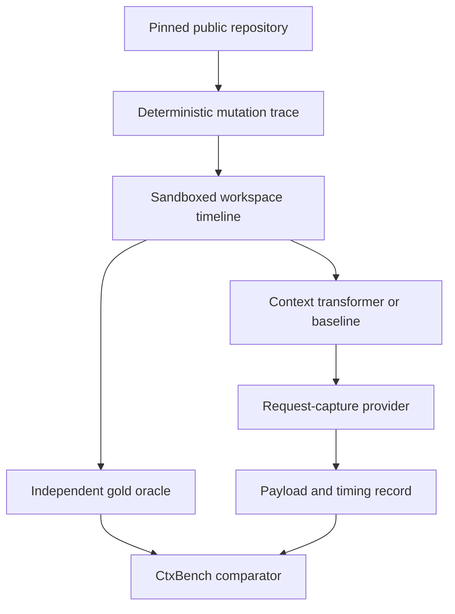

# CtxBench: Normative Evaluation Protocol

Status: design freeze candidate for FreshCtx 0.1. Keywords **MUST**, **MUST
NOT**, **SHOULD**, and **MAY** are normative.

## 1. What this benchmark proves

CtxBench evaluates a deterministic systems function:

\[
T(W_t, H_t, Q_t, B, \theta) \rightarrow (P_t, A_t)
\]

where:

- \(W_t\) is the byte-exact workspace snapshot at request time;
- \(H_t\) is a fixed event and message trace;
- \(Q_t\) is fixed task metadata used by the selection policy;
- \(B\) is the context budget;
- \(\theta\) is a frozen policy configuration;
- \(P_t\) is the exact provider payload;
- \(A_t\) is the external archive needed for recovery and audit.

The benchmark asks four questions:

1. Does the payload represent the current workspace correctly?
2. Does it preserve exactly what was intentionally removed from the payload?
3. How many bytes change or move between requests?
4. How long and how much memory does the transformation consume?

CtxBench **does not** ask whether a sampled model writes a better patch. It
makes no inference call, evaluates no generated program, and has no pass@1
metric. A model's programming behavior is stochastic and confounds the layer we
want to measure. Optional agent studies belong in a separate dataset and cannot
change a CtxBench result or waive a correctness failure.

## 2. Test architecture



The request-capture provider serializes the payload and returns a fixed sentinel
such as `FRESHCTX_CAPTURE_OK`. It has no model, sampling parameters, network
dependency, or semantic judge. For adapter tests, Pi or Hermes builds its native
request and sends it to this recorder. The recorder canonicalizes only transport
fields known to be volatile, such as request IDs; it never rewrites messages.

## 3. Reproducibility unit

Every published run MUST identify all of the following:

- FreshCtx or baseline commit SHA;
- public repository URL and immutable 40-character commit SHA;
- repository license identifier;
- trace schema version and trace SHA-256;
- mutation-family name and deterministic seed;
- policy JSON and SHA-256;
- adapter name, adapter commit, host name, and exact host version;
- Node/Python/runtime versions;
- OS, kernel, architecture, CPU model, available RAM, and filesystem;
- sandbox image digest or Nix/Devcontainer lock;
- warmup count, measured repetitions, concurrency, and cache condition;
- complete raw result record and exact provider-payload digest.

Moving Git refs such as `main` are allowed only during corpus bootstrapping.
`npm run repos:fetch` resolves them into `bench/repos.lock.json`. No public
measurement is valid until that lock is reviewed and committed.

The same rule applies to literature: `papers/manifest.json` defines the reading
set and `papers/papers.lock.json` records the exact PDF hashes used when the
evaluation was designed.

## 4. Public repository corpus

The bootstrap corpus is declared in `bench/repos.manifest.json`.

| ID | Language | Initial role | Why it is present |
|---|---|---|---|
| `flask` | Python | smoke/train | Decorators, functions, classes, compact files |
| `express` | JavaScript | smoke/train | Middleware, prototypes, mature source layout |
| `ripgrep` | Rust | development | Traits, implementations, macros, multi-crate scale |
| `typescript` | TypeScript | validation | Overloads, large files, generated and hand-written code |
| `go-tools` | Go | holdout candidate | Packages, methods, interfaces, tooling-scale graph |
| `neovim` | C and Lua | holdout candidate | Mixed languages, preprocessor, moves and deletes |

The roles above are a bootstrap proposal, not a permanent hidden test. Before a
benchmark release, maintainers MUST publish a split file. During autoresearch,
the agent MAY inspect training traces, MAY use validation only at scheduled
checkpoints, and MUST NOT run or inspect sealed holdout traces. Because the
repositories themselves are public, secrecy comes from unreleased trace seeds,
mutation choices, and gold labels. After release, a new benchmark version needs
new sealed traces or newer repository commits.

No repository is vendored into this project. The fetcher creates detached local
checkouts and records their resolved commits. Results MUST preserve upstream
attribution and licensing.

## 5. Trace construction

Traces conform to `bench/trace.schema.json`. A trace is data, not code. It
contains an initial workspace reference and an ordered timeline of successful
reads, exact mutations, request captures, session boundaries, and assertions.

### 5.1 Unit sampling

For each repository and language provider:

1. Enumerate parseable functions, methods, classes, modules, and whole files.
2. Exclude vendored dependencies, build output, minified files, generated files
   unless the scenario explicitly targets generated code, and files outside the
   repository root.
3. Record the qualified selector, byte range, line range, full bytes, and
   SHA-256 in an immutable candidate list.
4. Sort candidates by `sha256(commit + selector + scenario)` and take the first
   eligible \(n\). Do not hand-pick easy units.
5. Record why every rejected candidate was ineligible.

The initial smoke target is 10 units per mutation family in Flask and Express.
The full target is at least 50 units per family and language, subject to
eligibility. Sample counts and exclusions are reported.

Implemented status (measured 2026-08-28): `bench/unit-sampler.mjs` /
`bench/sample-units.mjs` enumerate whole files, rank with raw
`sha256(commit + selector + scenario)` (no colon join), and record
`parser-not-implemented` for non-source paths. Symbol-shaped units are out of
scope for this enumerator; they wait on the Tree-sitter sidecar (ADR 0004).
The sampler does not call `resolveRegion`.

### 5.2 Mutation families

The full suite MUST cover:

| Family | Workspace change | Property under test |
|---|---|---|
| `interior-edit` | Replace tokens inside preserved boundaries | Anchor refresh and stale removal |
| `insert-before` | Add lines before a tracked unit | Position independence |
| `grow-inside` | Insert a block inside a unit | Span change |
| `rename-boundary` | Rename function/class/signature | Structural identity and fallback |
| `move-in-file` | Move a unit within one file | Relocation |
| `move-cross-file` | Move a unit to another file | Provider identity and path update |
| `delete-unit` | Remove a tracked unit | Deletion, no stale fallback |
| `duplicate-boundary` | Create two equally plausible matches | Ambiguity safety |
| `rapid-two-write` | Apply two writes before one request | Update coalescing and final-state truth |
| `external-write` | Second deterministic process mutates a file | Concurrent workspace synchronization |
| `parse-broken` | Capture an intermediate syntax error | Fallback behavior |
| `line-ending` | LF/CRLF conversion | Canonicalization and identity |
| `overlap` | Track overlapping file/region/symbol reads | Deduplication |
| `budget-pressure` | Active set exceeds budget | Deterministic selection and omissions |
| `session-reload` | Restart adapter and restore state | Persistence and recovery |
| `path-safety` | Symlink escape, binary, oversized file | Security boundary and fail-open host behavior |

A context algorithm MUST NOT be tuned only on boundary-preserving edits.
Rename, move, delete, ambiguity, and parse-failure families are required gates.

### 5.3 Read patterns

Each mutation family is crossed with representative observations:

- one whole-file read;
- one exact symbol/region read;
- repeated reads of the same unit;
- overlapping reads;
- partial reads with offsets and limits;
- multiple files with stable and volatile units;
- a mutation without a subsequent explicit re-read.

The final case is essential: synchronization is useful only if the next request
can become fresh without relying on a stochastic agent to decide to re-read.

## 6. Independent oracle

The oracle MUST NOT call the candidate's resolver.

For whole files, gold is the raw byte sequence read from the sandbox after the
mutation barrier. For generated mutations, the generator records the exact
post-mutation unit bytes and offsets as it applies the patch. For historical Git
changes, gold comes from the checked-out before/after trees and a frozen label
file.

AST or LSP extraction MAY select initial candidates, but the gold output cannot
be produced by the same implementation under test. If FreshCtx uses
Tree-sitter, the benchmark SHOULD use explicit generator offsets or an
independent compiler/LSP oracle. A small stratified sample of gold labels MUST
be manually audited before a release.

Every capture has a declared required set \(G_i\). Required units are not
inferred from model behavior. The trace author declares them from prior read,
edit, and mutation events. Two budget regimes are separate:

- **satisfiable:** total gold bytes fit in \(B\); required recall MUST be 1;
- **overload:** gold exceeds \(B\); report the complete recall/bytes curve and
  compare policies at identical budgets.

## 7. Baselines

All baselines consume the identical trace and emit the identical host message
schema.

1. **Append-only:** raw tool observations stay in history; no synchronization.
2. **Append-only plus re-read:** the latest result is appended but earlier
   snapshots remain.
3. **Observation masking:** old read payloads become stable markers; no live
   automatic unit projection beyond explicitly re-read content.
4. **CORVUS whole-file reproduction:** observed files are registered, old
   payloads are masked, and one current whole-file copy is injected per request.
5. **FreshCtx file control:** FreshCtx registry and renderer at whole-file
   granularity. This isolates implementation effects from granularity effects.
6. **FreshCtx candidate:** current region/symbol resolution and working-set
   policy.

The CORVUS reproduction MUST document every deviation from the paper. FreshCtx
cannot claim to beat CORVUS if the reproduction is knowingly weaker or given a
different budget.

Native Pi and Hermes behavior is recorded as an integration reference, not
silently substituted for one of these algorithmic baselines.

## 8. Correctness metrics

Let \(P_i\) be all decoded code units present anywhere in the provider request,
not only in the live projection. Let \(G_i\) be the required current units. Each
unit has a logical identity and a byte-exact gold revision.

Projection units are decoded from their declared UTF-8 `content-bytes` length,
never by delimiter search. The evaluator includes adversarial fixtures whose
source text contains FreshCtx-like opening and closing tags.

### 8.1 Exact-current precision

\[
\text{exact\_current\_precision}_i =
\frac{|\{p \in P_i : bytes(p)=gold(id(p),t_i)\}|}{\max(1, |P_i|)}
\]

An irrelevant but current unit is current, though it may reduce selection
precision. A unit resolved to the wrong same-looking symbol is incorrect even
if some bytes happen to overlap.

### 8.2 Required-current recall

\[
\text{required\_current\_recall}_i =
\frac{|\{u \in G_i : \exists p \in P_i, id(p)=u \land bytes(p)=gold(u,t_i)\}|}
{|G_i|}
\]

Report both macro average per capture and micro aggregate per unit. Satisfiable
traces require 100%.

### 8.3 Stale-unit and stale-byte rate

A projected tracked unit is stale when its bytes differ from the current gold
revision for that identity.

\[
\text{stale\_unit\_rate}_i = \frac{\#stale\ units}{\max(1,\#projected\ tracked\ units)}
\]

\[
\text{stale\_byte\_rate}_i = \frac{\sum_{p\ stale}|bytes(p)|}
{\max(1,\sum_{p\ tracked}|bytes(p)|)}
\]

The full size of a stale unit is charged. A character-level diff would make a
nearly correct but wrong revision look deceptively safe.

### 8.4 Duplication

For logical unit \(u\), let \(n_i(u)\) be its number of full code copies across
history and projection.

\[
\text{duplicate\_unit\_copies}_i = \sum_u \max(0,n_i(u)-1)
\]

Duplicate bytes are the bytes in copies after the first current copy. Stable
markers do not count as code copies. The request MUST contain at most one full
current revision per tracked identity.

### 8.5 Historical raw leakage

For every captured observation revision, scan the canonical provider payload
for its exact bytes after it should have been masked. Report leaked revisions
and leaked bytes. To avoid false matches when an old revision is a substring of
the new one, fixtures include unique revision sentinels and the comparator also
uses decoded message boundaries.

### 8.6 Recovery integrity

Attempt exact recovery of every masked event by event ID and revision hash.

\[
\text{recovery\_success} = \frac{\#byte\text{-}exact\ recovered\ observations}
{\#masked\ observations}
\]

Missing, normalized, truncated, or cross-linked content is a failure.

### 8.7 Ambiguity and deletion safety

- `ambiguity_safe_rate`: ambiguous cases either resolve by independent stable
  identity or emit an explicit unresolved record; they never emit last-known
  bytes.
- `deletion_safe_rate`: deleted units are absent and explicitly tombstoned or
  unresolved; their previous bytes never appear as current.
- `path_escape_rate`: number of out-of-root or escaping-symlink bytes included
  in the projection divided by attempted unsafe bytes. The required value is 0.

### 8.8 Determinism

After canonical removal of transport-only volatile fields, hash the complete
payload for \(N\) identical runs.

\[
\text{deterministic\_agreement} =
\frac{\max_h count(h)}{N}
\]

The required value is 1.0. Canonicalization MUST NOT remove message order,
content, revisions, selections, or omission records.

### 8.9 Budget compliance

Report raw code bytes, rendered projection bytes, and full payload bytes.
`budget_overflow_bytes = max(0, budgeted_bytes - B)`. Explicit protocol headers
are reported separately. A system may define whether \(B\) covers code only or
the rendered projection, but the definition must be identical across baselines.

## 9. Efficiency and change metrics

### 9.1 Payload size

Primary size units are UTF-8 bytes:

- historical code bytes;
- live projection code bytes;
- rendered projection bytes;
- complete canonical provider-payload bytes;
- bytes saved relative to each baseline.

Token counts are secondary views computed with explicitly versioned tokenizers.
The main benchmark never uses the heuristic “characters divided by four” for a
public claim.

### 9.2 Transformation latency

Instrument these non-overlapping stages with a monotonic clock:

1. workspace snapshot/read;
2. unit resolution;
3. scoring and selection;
4. history masking;
5. rendering and provider serialization;
6. total blocking transformation.

The mutation barrier occurs only after the writer closes or atomically renames
the final file. `update_propagation_ms` is time from that barrier to the first
ready payload containing the correct new revision. For watcher-based designs,
also report background indexing time and the blocking portion separately.

Report min, p50, p95, p99, and max in milliseconds. Averages alone are not
accepted.

### 9.3 Context-delta amplification

Use a frozen byte-diff algorithm to compute changed bytes between consecutive
workspace snapshots and consecutive canonical payloads:

\[
\text{delta\_amplification}_i =
\frac{changedBytes(P_{i-1},P_i)}{\max(1,changedBytes(W_{i-1},W_i))}
\]

The current prototype's longest-common-prefix/suffix implementation is labeled
`proxy`; the public benchmark will use a frozen Myers or histogram diff and
publish both changed spans.

### 9.4 Cacheable-prefix reuse

\[
\text{prefix\_reuse}_i =
\frac{LCP(P_{i-1},P_i)}{\max(1,|P_{i-1}|)}
\]

Report longest-common-prefix bytes, ratio, first changed message, and stable
unit bytes before the first volatile unit. This is a provider-independent proxy,
not a claim that a provider actually served a cache hit.

Actual cache-read/cache-write tokens and time to first token MAY be measured in
a separate provider experiment. They are neither deterministic nor required for
core correctness, and must never replace the byte-level proxy.

### 9.5 Resource cost

Report:

- units and MiB refreshed per second;
- initial index time and incremental update time;
- peak RSS and heap used;
- registry/archive disk bytes;
- number of filesystem reads and bytes read;
- CPU time where the platform exposes it.

## 10. Performance procedure

Correctness runs and performance runs are separate. CI validates correctness;
dedicated hardware produces publishable timing.

For a timing cell:

1. Set locale to `C`, timezone to `UTC`, and record all environment variables
   that affect FreshCtx.
2. Disable network access inside the benchmark sandbox.
3. Use a read-only base checkout and a fresh writable copy-on-write worktree.
4. Run at least 10 unmeasured warmups.
5. Run at least 100 measured repetitions or justify a larger confidence-bound
   stopping rule.
6. Interleave baseline and candidate in an ABBA schedule to reduce thermal and
   background-load drift.
7. Use one process and one thread unless concurrency is the variable under test.
8. Report warm-process/warm-page-cache and fresh-process conditions separately.
   Do not call a new process a cold filesystem cache unless page cache was
   actually controlled.
9. Bootstrap paired median and p95 deltas with a fixed analysis seed.
10. Preserve every raw sample; never publish only an aggregate chart.

CPU affinity and fixed-frequency settings SHOULD be used when available. A CI
runner's timing can catch catastrophic regressions but cannot support a latency
claim.

## 11. Harness integration without a model

### Pi

Replay successful `read` tool events, then invoke the public `context` event.
Capture the messages Pi would send to the provider. Assert that persisted
session entries remain unchanged and the request-only copy satisfies every
freshness and pairing invariant.

### Hermes

Instantiate the context-engine plugin, call `on_turn_complete()` with a frozen
OpenAI-format trace, then call `select_context()`. Capture the returned request
list. Also force bridge failure and verify Hermes receives the original list.
The inherited built-in compressor is tested separately to ensure composition.

### Fake provider

The fake provider MUST:

- accept the host's native request schema;
- write one canonical JSONL record plus monotonic receive time;
- return a fixed valid terminal response;
- make no outgoing network request;
- reject a second semantic request when a test expects exactly one;
- expose zero sampling or model configuration.

No host is called “supported” until its adapter passes the same frozen trace
suite and preserves native assistant/tool/result protocol validity.

## 12. Result format

One raw JSONL record per repetition includes:

```json
{
  "schema_version": 1,
  "run_id": "uuid",
  "system": "freshctx-region",
  "system_commit": "40-hex",
  "repo": "flask",
  "repo_commit": "40-hex",
  "trace_sha256": "64-hex",
  "mutation_family": "interior-edit",
  "policy_sha256": "64-hex",
  "host": "core",
  "host_version": "0.1.0",
  "environment_sha256": "64-hex",
  "repetition": 1,
  "correctness": {},
  "bytes": {},
  "latency_ms": {},
  "resources": {},
  "payload_sha256": "64-hex"
}
```

The release artifact contains `results.jsonl`, `summary.json`, the frozen
manifests and locks, trace pack, environment description, analysis code, and a
failure ledger. Payload bodies MAY be omitted from the release when upstream
licensing requires it, but their hashes and reproducible generation path remain.

## 13. Gates and claim ladder

A candidate is invalid if any satisfiable trace has:

- exact-current precision below 1;
- required-current recall below 1;
- stale bytes above 0;
- duplicate current copies above 0;
- historical recovery below 1;
- ambiguity or deletion safety below 1;
- path escape bytes above 0;
- deterministic agreement below 1;
- an undeclared budget overflow;
- host-protocol corruption.

Invalid candidates are not ranked by speed or size.

Among valid candidates, report the full Pareto frontier. A Level 4 statement
that FreshCtx is a state-of-the-art context transformer requires:

1. all correctness gates on development, validation, and sealed holdout traces;
2. a faithful, reviewed CORVUS whole-file reproduction;
3. a pre-registered material improvement in at least one of projection bytes,
   p95 blocking latency, or delta amplification, with no material regression in
   the other frozen primary metrics;
4. reproduction across all declared language families;
5. request-capture reproduction through both Pi and Hermes;
6. public raw results, code, traces, locks, and negative cases.

The exact materiality tolerances are frozen before the holdout run. A sensible
starting proposal is at least 10% relative improvement for byte/latency metrics,
no more than 2 percentage points worse prefix reuse, and no more than 5%
relative regression in another efficiency metric. These numbers are proposals,
not results.

Permitted wording is narrow: “FreshCtx advances the correctness/bytes/latency
frontier for live code-context transformation under CtxBench vX.” It does not
mean “FreshCtx is the best coding agent” or “agents program better.”

## 14. Current implementation status

Implemented now:

- invariant tests for exact refresh, stable markers, ambiguity, recovery,
  deduplication, budget selection, and render ordering;
- one deterministic synthetic mutation fixture;
- append-only, re-read, whole-file-sync, and region-sync comparison;
- a 100-repetition `npm run ctxbench` latency/determinism runner;
- a loopback OpenAI-compatible capture provider with fixed responses and
  request hashes;
- paper and public-repository manifests plus fetch/verify tooling;
- a Pi extension and a Hermes `ContextEngine` plugin, both tracking whole files,
  line regions, and cat-class shell reads, both request-only, both fail-open;
- request capture through both adapters on smoke and holdout v0.1 traces, with
  adapter projection bytes asserted equal to the live core `freshctx-region`
  baseline.

The stateless rule constrains §8.1 and §8.2. `bytes(p)` means the bytes present
in the captured request. A revision attribute that names the gold digest is not
`bytes(p)`, and a body sent in an earlier request is not `bytes(p)` either. A
marker-only frame for a selected unit therefore scores zero on both metrics.
PCR 0077 scored it as a pass, and
[PCR 0079](lab/pcr/0079-stateless-byte-exact-requests.md) restored
content-only comparison in `bench/metrics.mjs`.

Not yet implemented and therefore not claimable:

- language parsers inside `src/` (out-of-process Tree-sitter module only;
  ADR 0004). That module now uses Tree-sitter WASM for Python, JavaScript,
  TypeScript, Go, and Rust;
- full public-repo symbol sampling (whole-file enumerator is in;
  sidecar-backed symbols are a later cut);
- full stage-level timing and peak-memory reporting in every adapter (§9.2 and
  §9.5 cannot be filled from this repository today);
- pinned Pi/Hermes compatibility tests against released host packages;
- production GHA freeze attestation on this laptop (consumption and binding
  check are implemented; a real `sealed` classification still requires a
  numeric Actions run).

Partially implemented (holdout v0.1 first slice; see PCR 0007, **unsealed**; freeze protocol in PCR 0009):

- frozen `repos.lock.json` now includes smoke + holdout candidate commits;
- first `public-repo-holdout` trace pack (10 traces, five families, two repos) — **unsealed-regression-development-pack**, not preregistered;
- holdout freeze/generate/run/report pipeline invariant for **new** packs (PCR 0009);
- one holdout execution with raw metrics recorded (not Level 4).

This boundary is intentional. CtxBench is the contract the next implementation
milestones must satisfy, not evidence that they are already complete.
