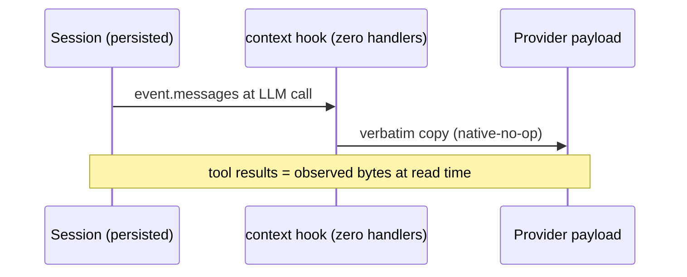
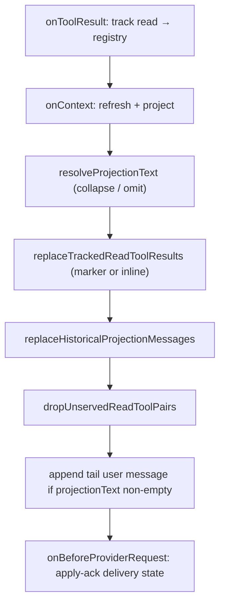
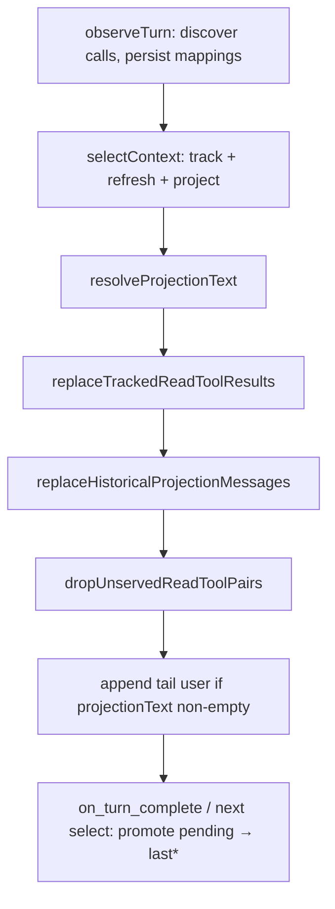

# Native harness compatibility — evidence and design space (PCR 0101)

Status: **design / evidence only** — no request-behavior change on `main` @
`d2fb1df`. The candidate transformation contract is **not approved**; this
document records investigation, competing designs, and gate criteria for a
follow-on implementation track.

Paper-manifest digest (verified this branch):
`442cd9e29a6550b3d539baa8522fd7c2c27fe8f9fef00d344ddf0092e5762e89`.

North star: **native harness compatibility with explicit, measurable
current-state improvement** — measured on effective model-visible context after
the same host policy, not serialized payload size alone when the provider
maintains server-side history.

## 1. Investigation conclusion

The unapproved hypothesis **partially survives** file-level inspection:

> FreshCtx replaces historical read bodies with markers. Later requests can send
> `[freshctx:already-served]`. `lastDeliveredCollapsedRevision` can then permit
> an empty projection tail. This may leave no quoteable current representation.

**Confirmed on replay (0098–0100):**

| Turn seam | Tool-result slot | Tail projection | Quoteable current bytes? |
|---|---|---|---|
| Turn 1 first inject | `stableReadMarker` | full `<freshctx-unit>` envelope | yes (in projection) |
| Turn 2 first-NEW (disk changed) | **inlined current bytes** (0098) | full envelope | yes (both slots) |
| Turn 3 first unchanged collapse | `stableReadMarker` | 99 B `[freshctx:already-served …]` | **no** (marker only) |
| Turn 4+ unchanged omit (0099) | `stableReadMarker` | **0 B** (empty tail) | **no** |

The gap is not hypothetical: after turn 3 collapse and turn 4+ omission, the
effective model-visible request carries summary markers at historical read slots
and an empty tail, with **no slot containing bounded current unit bytes** for
selected tracked units.

**Not disproved:** marker-plus-projection was the intended FreshCtx shape (0079
stateless core + adapter delivery state 0087–0100). The quoteability regression
on later unchanged turns is a **compatibility trade** introduced by collapse/omit
optimizations, not a projector bug.

**Live Hermes over-cap board** (user-reported on research box; not re-run here):
turn-1 projection ~40 496 B; later tail 99 B then 0 B; `quoteable_t2 false` on
that board — consistent with the replay gap when turn 2 is not the narrow
0098 first-NEW seam (large working set, unchanged disk).

## 2. Compatibility definition (operational)

A normal harness **generally**:

1. Preserves native message roles, IDs, ordering, and assistant↔tool pairing.
2. Retains tool output until an explicit truncation or compaction policy applies.
3. Handles stale files through rereads, refreshes, edit validation, or warnings.
4. Does **not** omit current bytes solely because an earlier stateless request
   contained them.

FreshCtx adapters already diverge from (2) and (4) by design (marker replacement,
prune unserved reads, collapse/omit tail). The open question is whether divergence
can be bounded so (4) holds in **effective model-visible context** — at least one
quoteable current representation per selected tracked unit — without giving up
deterministic budgeting or fair baseline comparison.

Measure **effective model-visible context** after the same host policy. Do not
use serialized payload size as a proxy when the provider maintains server-side
history.

## 3. Native Hermes request flow (without FreshCtx)

Source: frozen host checkout `999703fd` (`bench/hosts.lock.json`), replayed by
`bench/hermes-native-trace-runner.mjs` and documented in
[PCR 0032](../pcr/0032-native-host-context-bakeoff.md).

```mermaid
sequenceDiagram
    participant T as Transcript (persisted)
    participant CE as ContextEngine / ContextCompressor
    participant P as Provider payload

    T->>CE: conversationMessages + incoming user turn
    CE->>CE: should_compress? (threshold / budget)
    alt under threshold
        CE->>P: messages ≈ transcript + new user (native-no-op)
    else over threshold
        CE->>CE: prune_tool_results_only / compress
        CE->>P: pruned or summarized copy
    end
    Note over T,P: select_context is request-only; transcript unchanged
```

**Observed properties (holdout v0.1 native bake-off):**

- Full read tool results remain in the provider payload until Hermes'
  `ContextCompressor` fires ([PCR 0032](../pcr/0032-native-host-context-bakeoff.md)
  table: `hermes-native` stale-bytes on delete/interior-edit cells).
- On holdout-sized traces, compression is often a **no-op** (`native-no-op`):
  payloads are smaller than the compression threshold ([METRICS.md](../METRICS.md)
  PCR 0032 row).
- Stale bytes can persist when disk changes without a re-read (native stale
  columns in [holdout adapter bake-off](../../../bench/reports/holdout-adapter-bakeoff.md)).

**Request assembly** (`bench/hermes-native-trace-runner.mjs`):

- `captureMessages = [...persistedMessages, { role: "user", content: task }]`.
- Python bridge invokes frozen `ContextCompressor` — **no** FreshCtx registry,
  **no** marker replacement, **no** tail projection append.

## 4. Native Pi request flow (without FreshCtx)

Source: frozen host checkout `c49906ec`, replayed by
`bench/pi-native-trace-runner.mjs`.



**Observed properties:**

- Pi native replay registers **zero** `context` extension handlers
  (`bench/pi-native-trace-runner.mjs` lines 34–39, 118–119): persisted tool
  results pass through unchanged.
- Same stale-byte pattern as Hermes native on mutation families where disk
  changes without re-read ([PCR 0032](../pcr/0032-native-host-context-bakeoff.md)).

## 5. FreshCtx request flow — Pi

Entry: `adapters/pi/extension.ts` / replay twin `adapters/pi/replay.mjs`.



**Persisted vs provider-visible** (`adapters/pi/replay.mjs` lines 201–206):

- **Persisted:** Pi session stores original tool results and assistant replies.
  FreshCtx does not rewrite persisted history on the happy path.
- **Provider-visible:** `onContext` returns a **copy** with masked reads,
  optional tail projection, and pruned unserved pairs.

**Delivery state** (adapter-local, not core):

| Field | Set when | Used for |
|---|---|---|
| `lastInjectedRevision` | apply-ack after projection delivered | skip-eligible / collapse gate |
| `lastDeliveredCollapsedRevision` | apply-ack on collapsed marker | omit repeated stub (0099) |
| `pendingInjectedRevision` | each select | fail-close promotion (0087) |

Core `engine.project()` remains stateless per [ARCHITECTURE.md](../../ARCHITECTURE.md)
§6 and [PCR 0079](../pcr/0079-stateless-byte-exact-requests.md).

## 6. FreshCtx request flow — Hermes

Entry: `adapters/hermes/bridge.mjs` (`selectContext`, `observeTurn`).



**Hermes-specific seams:**

- `conversationMessages` vs narrowed `messages` slice — collapse and inline gates
  count **conversation history** ([PCR 0095](../pcr/0095-hermes-conversation-history-gate.md),
  `selectContext` passes `userCountMessages: conversationMessages` at
  `bridge.mjs` lines 691–697, 722–730).
- Request-only apply-ack when projection is not persisted in transcript
  ([PCR 0097](../pcr/0097-hermes-continue-request-only-ack.md)).
- `select_context()` is read-only for state writes; `observeTurn` persists
  ([ARCHITECTURE.md](../../ARCHITECTURE.md) Hermes integration).

## 7. Key symbols traced (adapters/request-prune.mjs)

| Symbol | Lines | Role |
|---|---|---|
| `stableReadMarker` | via `src/transcript.mjs:1-3` | Default masked read body |
| `replaceTrackedReadToolResults` | 150–180 | Swap tool-result content per unit |
| `shouldInlineServedReadAtToolResult` | 117–134 | Turn-2 first-NEW gate only |
| `servedReadToolResultContent` | 136–148 | Inline bytes vs marker |
| `resolveProjectionText` | 241–260 | Full envelope / collapse / **omit** |
| `shouldCollapseCurrentProjection` | 565–577 | All selected == skip-eligible |
| `currentProjectionMarker` | 204–206 | 99 B collapsed stub |
| `lastDeliveredCollapsedRevision` | consumed 254–255 | Enables zero-byte tail |

**Apply-ack wiring:**

- Pi: `adapters/pi/replay.mjs` 237–252 (`onBeforeProviderRequest`).
- Hermes: `adapters/hermes/bridge.mjs` 202–217 (`commitPendingInjectedRevision`).

## 8. Later-turn zero-byte case (characterization)

### 8.1 Replay timeline (0098-class small board)

From `test/pcr-0099-repeated-already-served-omit.test.mjs` and
`test/pcr-0098-quoteable-first-new-projection.test.mjs`:

| Turn | `projectionBytes` | Tool result at read slot | Quoteable? |
|---|---|---|---|
| 1 | >200 (full envelope) | `stableReadMarker` | yes (projection) |
| 2 (disk NEW) | ~427 | **inlined NEW body** | yes (both) |
| 3 (unchanged) | 99 | `stableReadMarker` | **no** |
| 4+ (unchanged) | **0** | `stableReadMarker` | **no** |

Turn 4 assertion (`0099` test lines 174–176): `turn4.projection.text === ""` and
payload text does **not** contain `[freshctx:already-served`.

### 8.2 Over-cap large board (0100)

From `test/pcr-0100-over-cap-unchanged-collapse.test.mjs`:

| Turn | `projectionBytes` | Notes |
|---|---|---|
| 1 | ~26 593 | 21 selected + 1 budget-omitted whole-file unit |
| 2 unchanged | ~100 | collapse `[freshctx:already-served units=21]` |
| 3–4 unchanged | **0** | omit repeated stub |

Disk-change guard: turn-2 edit still injects NEW full envelope (>1 000 B);
`skipEligibleSelections === 0` (0100 test lines 198–216).

### 8.3 Causal chain

1. `shouldCollapseCurrentProjection` → true when every **selected** unit matches
   `lastInjectedRevision` (`request-prune.mjs` 565–577).
2. First collapse emits `currentProjectionMarker` (99 B).
3. Apply-ack records `lastDeliveredCollapsedRevision`.
4. `resolveProjectionText` returns `""` when revisions match (241–256).
5. `replaceTrackedReadToolResults` does **not** inline (gate false outside
   turn-2 first-NEW) → `stableReadMarker` remains.
6. **Result:** zero-byte tail + non-quoteable read slots.

### 8.4 Tool-call / tool-result pairing

Pairing is preserved through all stages:

- `dropUnservedReadToolPairs` removes orphan pairs only for **unserved** reads
  (`request-prune.mjs` 579–668).
- Budget-omitted and unresolved reads keep pairs with truthful markers
  (`withReplacedReadBody`, 535–541).
- Collapse/omit affects **tail user message**, not assistant/tool structure.
- Empty tail: no extra user message appended (`pi/replay.mjs` 384–390,
  `bridge.mjs` 742–744).

## 9. Persisted history vs model-visible context

| Layer | Pi | Hermes | FreshCtx mutation |
|---|---|---|---|
| Persisted transcript | Session store: full tool bytes at observation time | Hermes session: full tool bytes | **Unchanged** on happy path |
| Request copy | `onContext` return value | `select_context` return value | Mask reads, prune, append/omit tail |
| Delivery memory | Adapter maps in extension/replay | `session.json` state file | `lastInjectedRevision`, `lastDeliveredCollapsedRevision` |
| Core projection | N/A | N/A | Stateless `engine.project()` every call |

**Implication:** omitting the tail saves provider bytes but does **not** remove
bytes from persisted history. Models that attend to read tool results (common
for “quote line N” tasks) lose current bytes when slots hold only
`stableReadMarker` and the tail is empty.

Native harnesses retain stale **observation-time** bytes instead — wrong for
freshness, but quoteable. FreshCtx trades freshness for markers, then may remove
the only fresh copy (tail) on later turns.

## 10. Competing designs

### Design A — Leave native read bodies while current (native-fidelity)

**Idea:** Stop replacing tool-result bodies with `stableReadMarker` while the
unit’s current revision matches the served revision and the path is still
selected. Persisted history stays historical; request copy shows **current**
bytes at the original slot (refreshed from workspace).

| Goal | Assessment |
|---|---|
| Native harness compatibility | **High** — matches “retain tool output until explicit compaction” |
| Fair baseline comparison | **Medium** — still adds tail projection unless disabled; compare at effective-visible layer |
| Current-content quoteability | **High** at read slot |
| Valid tool pairing | **Yes** — same call IDs |
| Deterministic budgeting | **Yes** — refresh is deterministic; cap via selection not omission of served bodies |

**Costs:** Duplicate bytes (read slot + tail envelope) on early turns; larger
payloads vs current FreshCtx; may regress collapse/omit savings (0100 tail
447→99→0 path).

**Boundary:** Adapter-only (`replaceTrackedReadToolResults`,
`servedReadToolResultContent`). Core unchanged.

### Design B — Bounded refresh in original tool-result slot (primary candidate extension)

**Idea:** Generalize 0098’s turn-2 inline to **every turn** where a unit is
selected and current: write bounded `unit.content` (respecting policy cap and
region grain) into the **official tool-result message** for the latest read call;
keep tail projection for envelope metadata or collapse to stub when all units
already delivered **and** read slots carry current bytes.

| Goal | Assessment |
|---|---|
| Native harness compatibility | **Medium–high** — read slot carries bytes like native |
| Fair baseline comparison | **High** — measure quoteability + bytes with explicit slot accounting |
| Current-content quoteability | **High** if inline gate covers turn 3+ |
| Valid tool pairing | **Yes** |
| Deterministic budgeting | **Yes** — bounded by same `budgetChars` selection |

**Costs:** Two copies on turns with full tail + inline; must define precedence
when tail is collapsed/omitted (inline becomes **sole** current copy — required
for quoteability invariant).

**Boundary:** Extend `shouldInlineServedReadAtToolResult` → rename/generalize;
**do not** change `src/projector.mjs` render rules. Fail closed when resolution
 fails (no last-known inject).

**0098 precedent:** `request-prune.mjs` 111–116 documents the seam; tests at
`test/pcr-0098-quoteable-first-new-projection.test.mjs` 351–409.

### Design C — Marker plus same-request current projection (status quo + 0098 patch)

**Idea:** Keep `stableReadMarker` at reads; rely on tail `<freshctx-unit>` for
current bytes. Collapse tail to stub, then omit — **current behavior** post-0099.

| Goal | Assessment |
|---|---|
| Native harness compatibility | **Low** on turn 4+ (zero tail, marker reads) |
| Fair baseline comparison | **High** for freshness metrics; **low** for quoteability |
| Current-content quoteability | **Fails** turn 3+ unchanged (proven replay) |
| Valid tool pairing | **Yes** |
| Deterministic budgeting | **Yes** — best byte savings (99→0) |

**Verdict:** Optimizes payload size at the expense of goal (3). Acceptable only
if quoteability is explicitly out of scope — **contradicts** north star and
SOUL.md “one current copy” in effective context.

### Design D — Hybrid: inline when tail omitted (minimal patch)

**Idea:** When `resolveProjectionText` returns `""`, require
`replaceTrackedReadToolResults` to inline selected units at read slots; when tail
carries full envelope, keep markers to avoid triple copies.

| Goal | Assessment |
|---|---|
| Quoteability on turn 4+ | **Repairs** the proven gap |
| Byte cost | **Lower** than always-inline |
| Complexity | **Medium** — two-mode adapter logic |

**Risk:** Turn 3 first collapse still has only 99 B stub + marker reads unless
stub counts as quoteable (it does not contain file bytes).

## 11. Proposed invariants (for implementation track)

**Primary (quoteability):**

> **Q1.** Every selected tracked unit has at least one quoteable current
> representation in the effective model-visible request — bounded UTF-8 body
> bytes, not merely a summary marker or revision id.

> **Q2.** Prior delivery never authorizes **complete** omission of current bytes
> for a selected unit across all model-visible slots (read results, tail
> projection, and recognized dump replacements).

**Preserved (non-negotiable from SOUL / AGENTS):**

| ID | Invariant |
|---|---|
| P1 | Persisted host transcript remains historical |
| P2 | Native roles, IDs, ordering, assistant↔tool pairing remain valid |
| P3 | Non-read tool results unchanged except stale-dump marker paths (0081–0091) |
| P4 | Adapter failure returns original request unchanged |
| P5 | Resolution failure never injects last-known content |
| P6 | Workspace-root and symlink protections intact (`safeWorkspaceFile`) |
| P7 | Selection order ≠ render order (core policy) |
| P8 | Payload bounds deterministic (`budgetChars`, omission reasons explicit) |

**CtxBench alignment:** Selected units in tail projection must still carry full
current bytes when the tail is present ([PCR 0079](../pcr/0079-stateless-byte-exact-requests.md)).
Quoteability invariants extend **adapter-visible** slots without relaxing core
stateless render rules.

## 12. Implementation boundaries

| Layer | In scope (future PRs) | Out of scope |
|---|---|---|
| `adapters/request-prune.mjs` | Generalize inline gate; tail-omit coupling | — |
| `adapters/pi/extension.ts`, `replay.mjs` | Wire quoteability modes | — |
| `adapters/hermes/bridge.mjs` | Hermes conversation gate parity | — |
| `src/projector.mjs`, `src/policy.mjs`, `src/anchors.mjs` | **Frozen** | No core retune |
| `bench/repos.lock.json`, fixtures, gold | **Frozen** | — |
| Tests | Characterization (PR 2) then behavior | — |

No model-specific behavior in core. No new dependencies in prototype core.

## 13. Go / no-go / rollback criteria

### Proceed (implementation after review)

- [ ] PR 2 characterization tests encode Q1/Q2 on turn 3, 4+, over-cap, Hermes
  narrowed slice, and Pi persisted-vs-request split **without** changing production
  paths until tests are agreed.
- [ ] Design choice (B or D) written into ADR or PCR with explicit byte budget
  accounting.
- [ ] Replay proves quoteability **or** documents accepted trade with user sign-off.

### Revise

- Quoteability fix regresses `AUTORESEARCH_SCORE` or ctxbench hard gates.
- Pairing breaks on any official-loader host-contract board (0096/0097 class).
- Inline path injects last-known bytes on resolution failure.

### Stop

- Cannot satisfy Q1 and deterministic budgeting simultaneously without exceeding
  native payload size by a declared multiple — requires product decision.
- Live remeasure shows native harness already omits current bytes under host
  policy (would shift north star to match provider-server history semantics).

### Roll back

- Restore pre-change adapter behavior; `lastDeliveredCollapsedRevision` omit path
  remains if quoteability mode is flag-gated.
- Door `f8771c93894095348185ef3453a3c2498355b3c6` and lock
  `79e29d09a9ec12b1128617f683f50a35a3c8809e` unchanged.

## 14. Known limitations (this document)

- No live Pi/Hermes rerun on this VM; live over-cap numbers cited from user board
  on research box via PCR 0100.
- Hermes official-loader host-contract tests (`0096`/`0097`) fail here
  (`bench/hosts/hermes` absent) — 2 failures in `npm test` (318 total, 293 pass,
  23 skip).
- `npm run evaluate` exits non-zero on this VM due to the same test gate; ctxbench
  hard gates pass independently.
- Live 0098–0100 telemetry tables are on the research box, not yet folded into
  [METRICS.md](../METRICS.md) live section.
- Provider server-side history (Anthropic/OpenAI caching) not measured — only
  serialized request bytes.

## 15. Recommended next step

**Start PR 2 (characterization tests only)** after this evidence PR merges:
encode Q1/Q2 as failing or skipped tests on turn 3+ and over-cap boards mirroring
0098–0100 fixtures; no adapter behavior change until tests are reviewed.

## 16. Evidence index

| Artifact | Location |
|---|---|
| Marker definition | `src/transcript.mjs:1-3` |
| Inline gate | `adapters/request-prune.mjs:117-148` |
| Collapse / omit | `adapters/request-prune.mjs:241-260`, `565-577` |
| Pi request copy | `adapters/pi/replay.mjs:321-407` |
| Hermes select | `adapters/hermes/bridge.mjs:684-754` |
| Native Pi replay | `bench/pi-native-trace-runner.mjs:34-119` |
| Native Hermes replay | `bench/hermes-native-trace-runner.mjs:71-74` |
| PCR 0098–0100 tests | `test/pcr-0098-*.test.mjs` … `test/pcr-0100-*.test.mjs` |
| Official metrics ledger | `docs/lab/METRICS.md` |
| Architecture split | `docs/ARCHITECTURE.md:30-32`, `178-209` |
